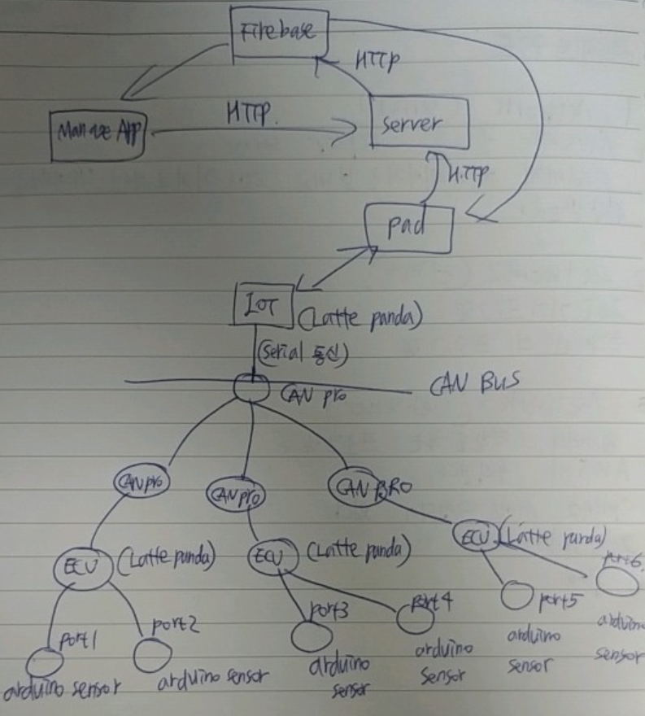
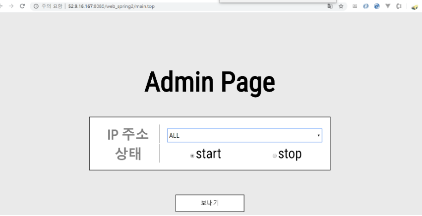

# iot_semi_tcp_ip

* network ( server)

  AWS에 올라가는  TCP/IP 서버 

  pad에게 제어 메시지를 보내고 IOT 기기로 부터 데이터를 전달 받는다. 

* network2 (client)

  IOT 기기 프로그램

  클라이언트의 프로그램

* network3 ( web_spring2)

  웹서버의 역할을 하는 프로그램 

  AWS에 올라간다. 

  Spring 서버, 웹 클라이언트로 구성되어 있다.

  IoT기기를 제어하는 값을 manage_app으로 부터 받아 파이어베이스로 http 통신한다. 

* manage_app

  관리자가 IoT 기기를 제어하는 곳 

  안드로이드 앱이고 파이어베이스와 연동하였다. 

* pad 

  IOT 기기와 TCP/IP 통신하여 값을 주고 받는다.

  웹서버의 TCP/IP 서버로 IOT기기의 데이터를 전달한다. 

  파이어베이스로 부터 IOT기기의 데이터 경고값을 받는다.( 예를 들어 IOT기기가 고온이다.)

## 2. 시스템 구성도 

1. IoT

   * Pad와 연결된 IoT 장비들을 의미합니다.
   * IoT 기기들은 최상단의 Can Pro를 통하여 Can Pro와 연결되어 있습니다. 
   * IoT 기기와 Can 장비와 serial 통신을 통하여 데이터를 주고 받습니다. 
   * IoT 기기는 Latte panda를 사용하였습니다. 
   * IoT 기기는 pad로 주기적으로 데이터를 전달합니다. 

2. Pad

   * IoT 기기들과 직접 데이터를 주고 받는 장치입니다. 
   * 관리자 한명에 패드가 여러개 일 수 있습니다.
   * 패드에서 연결된 기기들을 볼 수 있습니다. 
   * 기기들의 데이터 전송을 시작, 정지 할 수 있습니다. 
   * 장비에서 발생하는 데이터가 90 이상인 경우와 20 이하 인 경우 경고를 받습니다.
   * 관리자인 manageApp에게 데이터를 보냅니다. 

3. Firebase cloud messaging

   * 스프링에서 파이어베이스로 fcm notification을 요청하고 파이어베이스에서 notification을 안드로이드 기기로 보낸다. 

   * 스프링 웹서버에서 보낸 데이터를 manageapp과 pad로 보낸다. 
   * 특정 topic이나 토큰을 가진 기기에게 데이터를 전송한다. 
   * manageapp의 topic은 temperature_manage 이고 app의 topic은 temperature이다. 

4. Server

   * 서버는 웹서버와 pad 사이에서 데이터를 주고 받는 관문입니다. 
   * 양쪽간에 소켓을 열고 그 스트림위에서 TCP/IP 통신을 합니다. 

5. Web server 

   * 웹서버는 FCM notification을 파이어베이스에 HTTP로 요청한다. 

   * manageapp 관리자 기능과 동일하게 웹 서버에서도 IoT 장비를 시작 및 중지 할 수 있는 

     메시지를 보낼 수 있다. 

6.  ManageApp

   * 안드로이드 앱을 통해서 IoT 장비의 ip 주소를 입력하고 장비를 시작 및 중지 한다. 
   * FCM 메시지를 파이어베이스를 통해서 받는다. 
   * HTTP 방식으로 웹서버에게 제어 메시지를 보낸다. 

## 3. IP 주소 & Port 

### 서버

----

ip : 52.9.16.167

port : 8888

### 패드 

----

ip: 와이파이 환경에 따라서 다름

port : 9999

### 웹서버

-----

ip : 52.9.16.167

port : 8080, 80

## 4. 실행 결과 화면

* 관리자 페이지 ( web_spring2)

* 패드 화면 

  
  
* 패드와 연결된 기기 화면 